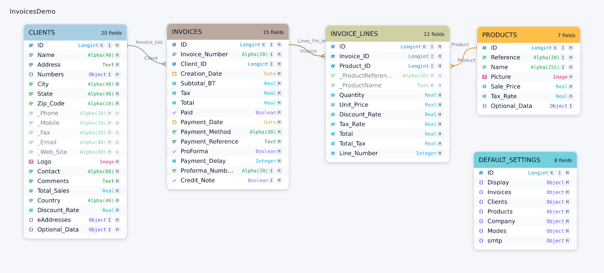

# 4d-catalog-diagram

Turn a 4D database catalog (structure XML) into an interactive HTML diagram, a
standalone SVG, or a PNG.

- **One static binary.** No Python, no Node, no network, no runtime that has to
  be installed first.
- **Self-contained output.** The HTML file inlines its own CSS, JavaScript and
  the whole diagram; it works from `file://`, offline, and as an email
  attachment.
- **Deterministic.** The same command on the same input produces byte-identical
  output, so diagrams can be committed and diffed.

<!-- Regenerate with:
     4d-catalog-diagram references/InvoicesDemo.xml \
       -f png --layout as-designed --scale 1 -o docs/example.png -->


## Install

Download the binary for your platform from the
[latest release](https://github.com/miyako/4d-catalog-diagram/releases/latest),
then make it executable:

```sh
tar xJf 4d-catalog-diagram-macos-arm64.tar.xz
chmod +x 4d-catalog-diagram
./4d-catalog-diagram --version
```

Releases are published for macOS, Linux and Windows on both x64 and arm64.
Every asset is a `.tar.xz` containing the binary, the README and the licence.

### macOS: clearing the quarantine flag

The release binaries are **not code-signed or notarized**. Anything downloaded
through a browser or `curl` is tagged with `com.apple.quarantine`, and macOS
refuses to run it — usually with a dialog along the lines of *"4d-catalog-diagram"
cannot be opened because the developer cannot be verified*, or a bare
`zsh: killed`. Nothing is wrong with the binary; the flag is.

Remove it once, after unpacking:

```sh
xattr -d com.apple.quarantine ./4d-catalog-diagram
```

If `xattr` reports that the attribute is missing, the file was never
quarantined and there is nothing to do. To check first:

```sh
xattr -p com.apple.quarantine ./4d-catalog-diagram
```

You will not hit this if you build from source, or if you install the copy
published by [`miyako/skills`](https://github.com/miyako/skills), whose release
pipeline signs and notarizes the macOS binaries.

Or build from source with a Rust toolchain:

```sh
cargo build --release      # target/release/4d-catalog-diagram
```

## The input

A 4D catalog XML export: a `<base name="…">` root containing `<table>` elements
with `<field>` children, plus `<relation>` elements. `references/InvoicesDemo.xml`
in this repository is a complete example. Parsing is permissive — unknown
elements and attributes are ignored rather than rejected, and UTF-8, UTF-16 and
legacy single-byte encodings are detected automatically.

### Field types

Type names follow 4D's own presentation rules rather than the raw type code:

- **Type 21 is `Object`**, not `Blob`. 4D's SQL mapping stores an object field
  as a BLOB, but that is a storage detail — the structure editor shows it as
  `Object`.
- **`Alpha` vs `Text` is decided by the length limit, not the code.** Codes 10,
  14 and 17 are all string fields; a field with a `limiting_length` is shown as
  `Alpha(n)` and one without is shown as `Text`.

Unrecognised codes degrade to a generic `Type {n}` label instead of failing, so
a newer catalog still renders.

## Usage

```
4d-catalog-diagram [OPTIONS] [INPUT]
4d-catalog-diagram <render|inspect|validate> [OPTIONS] <INPUT>
```

With no subcommand, a path is treated as `render`. `-` reads from stdin.

### Examples

Render the whole catalog to `InvoicesDemo.html` next to the input:

```sh
4d-catalog-diagram references/InvoicesDemo.xml
```

Render just `INVOICES` and everything one relation-hop away, as SVG:

```sh
4d-catalog-diagram references/InvoicesDemo.xml \
  --focus INVOICES --depth 1 -f svg -o invoices.svg
```

That selects `INVOICES`, `CLIENTS` and `INVOICE_LINES`. `PRODUCTS` sits one hop
further out, so it is drawn as a dimmed "ghost" stub showing that the
neighbourhood continues — use `--external-refs hide` to drop it, or
`--external-refs include` to draw it in full.

Answer a question about the catalog without rendering anything:

```sh
4d-catalog-diagram inspect references/InvoicesDemo.xml | jq '.analysis'
```

Render a retina PNG of the tables whose names start with `INVOICE`:

```sh
4d-catalog-diagram references/InvoicesDemo.xml \
  --tables-match '^INVOICE' -f png --scale 2 -o invoices@2x.png
```

Pipe a catalog in and an SVG out:

```sh
cat structure.xml | 4d-catalog-diagram render - -f svg -o - > structure.svg
```

### Options

| Option | Meaning |
| --- | --- |
| `-o, --output <PATH>` | Output file. Defaults to `<input-stem>.<ext>` next to the input. `-` writes SVG/HTML to stdout. |
| `-f, --format <svg\|png\|html\|mmd\|dot>` | Output format. Default `html`. |
| `--tables <CSV>` | Explicit table allow-list. |
| `--tables-match <REGEX>` | Regex allow-list over table names. |
| `--focus <TABLE>` | Centre a neighbourhood selection on one table. |
| `--field <TABLE.FIELD>` | Focus on a single field: its table plus the tables joined *through that field*. |
| `--depth <N>` | Hop count for `--focus`/`--field`. Default `1`. |
| `--external-refs <ghost\|hide\|include>` | What to do with tables just outside the selection. Default `ghost`. |
| `--hide-system-fields` | Drop 4D-internal (`visible="false"`) fields entirely. |
| `--no-collapse` | HTML only: always draw every field row instead of collapsing dense tables. |
| `--layout <as-designed\|auto>` | Default `as-designed`. |
| `--theme <light\|dark\|auto>` | Default `auto` for HTML, `light` for SVG/PNG. |
| `--title <STRING>` | Override the displayed diagram title. |
| `--scale <N>` | PNG raster scale factor. Default `2`. |
| `--max-tables <N>` | Safety cap on the selection size. Default `300`. |
| `--embed-timestamp` | Embed a generation timestamp. Off by default because it breaks reproducibility. |
| `--error-format <text\|json>` | `json` writes one diagnostic object per line to stderr. |
| `-q, --quiet` | Suppress non-error chatter. |

### Text formats

`--format mmd` and `--format dot` skip layout and rasterization entirely and
emit source for another tool to lay out:

```sh
4d-catalog-diagram catalog.xml -f mmd -o - >> notes.md
4d-catalog-diagram catalog.xml -f dot -o - | dot -Tsvg > catalog.svg
```

`mmd` is a Mermaid `erDiagram`: one entity per table, `PK`/`UK` markers on key
fields, and a `||--o{` line per relation. It pastes straight into a Markdown
file that GitHub, GitLab or Obsidian will render.

`dot` is a Graphviz `digraph` with `rankdir=LR` and record-shaped nodes. Every
field gets a port, so relation edges attach to the field that actually carries
the join rather than to the middle of the box.

Both grammars are far stricter about identifiers than 4D is about object names,
so table, field and type names are reduced to `[A-Za-z0-9_]` (uniquely — two
names that would collide get a numeric suffix) and relation labels are stripped
of anything that could terminate a string. `--layout`, `--theme` and `--scale`
have no effect on these formats.

### Layout

`--layout as-designed` (the default) reuses the position each table was given in
4D's own structure editor, so the diagram matches the mental map the developer
already has. Card *size* is always recomputed from this tool's own text metrics
and never taken from the XML, because 4D's stored sizes are collapsed-state
boxes that would clip real field names. Positions are rescaled by the median
size ratio so the designer's relative spacing survives the larger cards, and
any table without stored coordinates is parked in free space below the ones
that have them.

That only holds while *most* of the selection has coordinates. If fewer than
**80%** of the selected tables carry usable positions, mixing stored and
invented placements looks worse than not using the stored ones at all, so the
whole selection falls back to `auto` and a warning is written to stderr. The
threshold is `COORDINATE_COVERAGE_THRESHOLD` in `src/scene.rs`. Ghost tables
(references to tables outside the selection) never have coordinates and are
excluded from the calculation.

`--layout auto` ignores stored positions and runs a deterministic
force-directed layout instead. Useful when the catalog was never arranged by
hand, or when the stored arrangement is a mess.

In HTML output both layouts (and both system-field settings) are rendered ahead
of time, so the sidebar toggles switch between them instantly without
re-running the CLI.

### The HTML diagram

- Drag to pan, scroll or pinch to zoom, `Fit` to reset.
- Click a table in the sidebar or on the canvas to highlight it and everything
  it is related to.
- Click a connector for the relation's details: both relation names, integrity
  rule and auto-load flags.
- `/` focuses the filter box; `Esc` clears the selection.
- Tables with more than 10 fields are collapsed to the first 8 with a
  *Show N more* toggle. Expanding draws over the neighbouring cards rather than
  reflowing the diagram, so the layout and every connector stay put, and only
  one card is expanded at a time. Pass `--no-collapse` to switch this off.
  Static `svg`/`png` output is never collapsed — a still image has no way to
  reveal a hidden row.
- Deep links work offline: `out.html#CLIENTS` selects and centres on that table,
  and `out.html#CLIENTS.ID` additionally highlights that one field, expanding
  the card first if the field is behind the *Show N more* cut. Clicking a table
  or a field updates the fragment, so the address bar is always a shareable
  link to what you are looking at.
- Diagrams with 16 or more tables get a minimap in the bottom-right corner;
  click or drag it to pan. Smaller diagrams don't, because there it would be
  clutter rather than navigation.
- Export the current view as SVG or PNG straight from the page.
- With JavaScript disabled the diagram still renders — it is server-side SVG,
  it just doesn't pan or zoom.

## `inspect` output

`inspect` prints the catalog as JSON: every table with its fields, types, flags
and relation counts, every relation with both endpoints, plus an `analysis`
block listing tables without a primary key, isolated tables, and the most
connected tables. Arrays are sorted by name so the output diffs cleanly.

## Exit codes

| Code | Meaning |
| --- | --- |
| `0` | Success |
| `1` | Usage error |
| `2` | Input file could not be read |
| `3` | Malformed XML |
| `4` | Selection matched no tables, or exceeded `--max-tables` |
| `5` | Render or write failure |

## Development

```sh
cargo test           # unit + end-to-end tests
cargo clippy --all-targets
cargo fmt --check
```

The pipeline is split so each stage is testable on its own:
`parse` → `select` → `layout` → `scene` → `render_svg` / `render_html` / `raster`.

`BUILD-SPEC.md` is the original specification. `SKILL.md` is the agent-facing
usage guide for when this binary ships as part of a skill bundle.

## License

MIT. The bundled DejaVu fonts are used for text measurement and headless PNG
rasterization only; see `assets/fonts/LICENSE-DejaVu.txt`.
